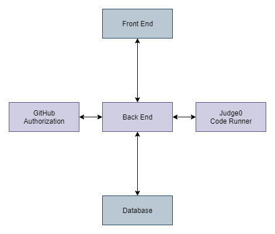

# AlgoLearn Architecure

---

## Front End

Anyone may access the front end server via web browser,
where they may view/search posted problems, users, and
visuals. Any user may read, create, delete, and modify content via api calls to the back end.

 

## Back End

The backend provides an [api](https://redocly.github.io/redoc/?url=https://raw.githubusercontent.com/AlgoLearnWCSU/AlgoLearnApi/dev/docs/swagger.yml) for
users to manipulate the database. The api for creating,
updating, and deleting is restricted to authorized
users. Solutions from users are passed to a code
running service before it is submitted to the database.

 

## Code Runner

 

## User Authorization

 
